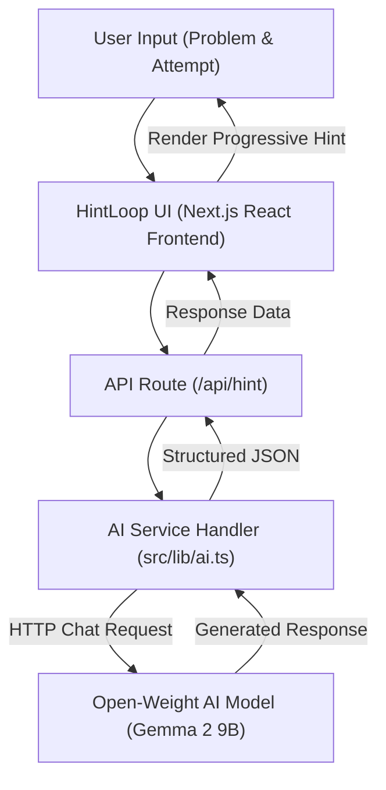

# HintLoop

A DSA tutor that helps you think, not copy.

## Demo

* Live Demo: [Add URL]
* Demo Video: [Add URL]

## Why I Built This

HintLoop was built for a friend who is actively preparing for Data Structures and Algorithms (DSA) interviews and computer science exams. 

When practicing DSA problems, they frequently ran into a common roadblock: after writing an initial attempt or getting stuck on a bottleneck, they didn't know what step to take next. Jumping directly to official editorial solutions or asking generic AI chatbots immediately revealed complete solution code. This spoiled the critical problem-solving process and made it difficult to retain key algorithmic patterns.

HintLoop was created to bridge this gap by acting as a patient tutor that evaluates the student's actual attempt and offers targeted, progressive nudges without spoiling the final solution.

## The Idea

HintLoop enforces a progressive hint hierarchy designed to preserve the learning process:

```
Problem & Attempt Input
        ↓
Hint 1 — Direction & High-level pattern
        ↓
Hint 2 — Target Data Structure or Algorithmic technique
        ↓
Hint 3 — Key Observation / Invariant insight
        ↓
Hint 4 — Detailed Implementation Guidance & Logic flow
        ↓
Full Approach — Complete strategy, time/space complexity & Go implementation
```

Instead of giving away the answer upfront, the system encourages the user to think through each stage of the problem-solving pipeline.

## Features

* **Attempt-Aware Nudges**: Analyzes both the problem statement and the user's specific logic attempt or bottleneck.
* **5-Tier Progressive Stepper**: Delivers hints incrementally, from high-level direction to specific implementation guidance.
* **Full Solution Disclosure**: Only reveals the complete optimal approach, complexity analysis, and solution code when explicitly requested.
* **Preset Demo Problems**: Includes curated sample DSA problems (*Container With Most Water*, *Longest Substring Without Repeating Characters*, *Course Schedule*) for immediate testing.
* **Offline Simulation Fallback**: Functions seamlessly even without an API key using built-in simulated responses.
* **Clean Developer UI**: Modern light theme interface built with custom inline SVG icons, avoiding heavy icon dependencies and pill-shaped components.

## How It Works

HintLoop is built as a web application with a Next.js frontend and API route backend that interfaces with open-weight AI models.



1. The user inputs the problem description and their current attempt in the React interface.
2. The client sends a request to the `/api/hint` Next.js route handler.
3. The server constructs a system prompt tailored to the requested hint level and dispatches it to the configured AI provider endpoint.
4. The open-weight model evaluates the attempt and returns a hint structured specifically for that stage of learning.

## Open-Weight AI

HintLoop uses **Google's Gemma 2 9B** (`gemma-2-9b-it`) as its default core AI model.

* **Model Used**: `gemma-2-9b-it` (Gemma 2 9-Billion Parameter Instruction-Tuned model).
* **Where It Runs**: Called via hosted open-weight API endpoints (such as OpenRouter, Groq, Hugging Face, or Google AI Studio) or executed locally using [Ollama](https://ollama.ai) (`gemma2:9b`).
* **How It Is Called**: Via standard HTTP POST requests to OpenAI-compatible `/chat/completions` API endpoints in `src/lib/ai.ts`.
* **Why This Model Was Selected**: Gemma 2 9B delivers strong code analysis and reasoning capabilities at a compact parameter size, making it fast and accurate at evaluating logic flaws without requiring heavy commercial models.
* **Dependent Components**: The hint evaluation logic in `src/lib/ai.ts` and the `/api/hint` backend route directly depend on the model.

## Why Open Innovation Matters

Using an open-weight model for an educational developer tool provides concrete advantages:

* **Provider Independence**: The application is not locked to a single vendor. It can switch between OpenRouter, Groq, Hugging Face, or local runtimes by changing environment configuration.
* **Local & Private Inference**: Students can run the model locally using Ollama (`gemma2:9b`) without sending problem code or personal notes to external cloud providers.
* **Cost Efficiency**: Students practicing multiple DSA problems daily do not need expensive per-token subscription plans.
* **Behavior Customization**: Open models allow predictable system prompt adherence for constrained hint generation without unprompted solution dumping.

While closed commercial models offer ultra-large parameter scale, open-weight models like Gemma 2 provide sufficient reasoning for algorithmic tutoring while enabling local execution and zero-vendor-lockin.

## Tech Stack

| Layer | Technology |
| ----- | ---------- |
| Frontend | Next.js 14 (App Router), React 18, Tailwind CSS |
| Backend | Next.js Route Handlers (Node.js) |
| AI Model | Gemma 2 9B (`gemma-2-9b-it`) |
| Model Provider / Runtime | OpenRouter / Groq / Ollama / Google AI Studio / Hugging Face |
| Database | None |
| Deployment | Render |

## Getting Started

### Prerequisites

* Node.js 18.x or higher
* npm (or pnpm / yarn)

### Clone

```bash
git clone https://github.com/SudhanshuMatrix/HintLoop.git
cd HintLoop
```

### Environment Variables

Copy `.env.example` to `.env.local`:

```bash
cp .env.example .env.local
```

Configure your environment in `.env.local`:

```env
# AI Provider: 'openrouter' | 'groq' | 'ollama' | 'huggingface' | 'google'
AI_PROVIDER=openrouter

# Model Identifier
AI_MODEL=google/gemma-2-9b-it:free

# API Key (Leave blank to use built-in simulated demo mode)
AI_API_KEY=your_api_key_here

# Optional: Custom endpoint for local Ollama instance
# AI_API_BASE=http://localhost:11434/v1
```

### Install

Install project dependencies:

```bash
npm install
```

Or using the included `Makefile`:

```bash
make install
```

### Run

Start the development server:

```bash
npm run dev
```

Or using `Makefile`:

```bash
make dev
```

Open [http://localhost:3000](http://localhost:3000) in your browser.

### Build

Create a production build:

```bash
npm run build
```

Or using `Makefile`:

```bash
make build
```

Start the production server:

```bash
npm run start
```

## Deployment on Render

HintLoop is configured for deployment on [Render](https://render.com).

### Deploying via Render Blueprint (Recommended)

1. Push your repository to GitHub or GitLab.
2. Log in to [Render Dashboard](https://dashboard.render.com/) and click **New +** > **Blueprint**.
3. Connect your repository. Render will automatically detect the `render.yaml` blueprint file.
4. Set your `AI_API_KEY` in the Render environment variables settings.
5. Click **Apply**. Render will build and deploy your Web Service automatically.

### Manual Render Web Service Setup

If deploying manually via the Render Dashboard:

1. Click **New +** > **Web Service**.
2. Connect your repository.
3. Configure the service parameters:
   - **Runtime**: `Node`
   - **Build Command**: `npm install && npm run build`
   - **Start Command**: `npm run start`
4. Add Environment Variables:
   - `AI_PROVIDER`: `openrouter` (or your preferred provider)
   - `AI_MODEL`: `google/gemma-2-9b-it:free`
   - `AI_API_KEY`: `your_api_key`
5. Click **Create Web Service**.

## Project Structure

```
HintLoop/
├── Makefile                # Utility command shortcuts (install, dev, build, clean)
├── render.yaml             # Render deployment blueprint
├── .env.example            # Environment template for model configuration
├── package.json            # Project dependencies and scripts
├── tailwind.config.js      # Styling configuration (custom colors & border radii)
├── src/
│   ├── app/
│   │   ├── api/hint/route.ts  # Backend endpoint for hint processing
│   │   ├── globals.css        # Base styles and code formatting rules
│   │   ├── layout.tsx         # App layout shell
│   │   └── page.tsx           # Main workspace UI
│   ├── components/
│   │   ├── Header.tsx         # Navigation header & Gemma status indicator
│   │   ├── HintPanel.tsx      # Progressive hint stepper & response display
│   │   ├── Icons.tsx          # Custom inline SVG icon components
│   │   ├── ProblemInput.tsx   # Problem description and attempt textareas
│   │   └── SampleProblems.tsx # Demo problem selection modal
│   └── lib/
│       ├── ai.ts              # Model provider integration & fallback engine
│       ├── samples.ts         # Pre-configured sample DSA problems
│       └── types.ts           # TypeScript interfaces
```

## Example

Here is a standard interaction flow in HintLoop:

1. **Paste Problem**: The user enters the problem description for *Container With Most Water*.
2. **Detail Attempt**: The user inputs their current idea: *"I wrote a nested loop checking all pairs (i, j). It takes O(N^2) and gets Time Limit Exceeded. How do I optimize to O(N)?"*
3. **Request Hint 1**: The user clicks **Get Hint**. HintLoop returns a directional nudge: *"Consider starting with the widest container using pointers at index 0 and n-1..."*
4. **Request Hint 2**: The user requests another hint. HintLoop suggests the **Two Pointers** technique and asks which pointer should shrink.
5. **Progressive Nudges**: The user works through Hint 3 (Key Observation) and Hint 4 (Implementation Guidance).
6. **Reveal Approach**: Once satisfied, the user clicks **Show Approach** to inspect the optimal $\mathcal{O}(N)$ strategy and Go code.

## Design Philosophy

**“Don't give me the answer. Help me find it.”**

The interface intentionally avoids decorative bloat, heavy animations, neon accents, or glassmorphism. It uses a crisp, light-themed layout designed to feel like a serious developer tool focused entirely on problem-solving.

## Built for a Friend

* **Target User**: Built for a real friend preparing for technical coding interviews.
* **The Challenge**: They struggled with jumping straight to LeetCode solutions whenever their code failed.
* **The Solution**: HintLoop provides immediate, step-by-step assistance scoped directly to their current code attempt.
* **Feedback**: [Feedback pending - newly created for the challenge].

## Hacktoberfest 2026

HintLoop was developed for the **Hacktoberfest 2026 DEV Challenge: “Build for a Friend”**.

* **Challenge Theme**: Build a software solution tailored to one real person's daily workflow or learning goal.
* **Open-Weight AI Requirement**: Built around the Gemma 2 open-weight model family.
* **Focus**: Solving a real problem with practical, non-intrusive software design.

## What I Learned

1. **System Prompt Restraint**: Designing system prompts that enforce progressive disclosure requires explicit level constraints to prevent the model from leaking solutions early.
2. **Resilient AI Architectures**: Building a dual-mode service layer (`src/lib/ai.ts`) ensures the UI remains fully functional even during cloud API rate-limits or offline testing.
3. **Clean UI Component Isolation**: Writing custom SVG components instead of importing large icon packages keeps bundle sizes small and visual styling consistent.
4. **Scaffolding vs. Automation**: Software designed for learning must intentionally withhold information to build user understanding.

## Future Improvements

* **Language Selector**: Expand solution code generation to C++, Java, and Python alongside Go.
* **Code Diff Analysis**: Allow users to paste raw code files and highlight specific logical edge cases.
* **Session Persistence**: Save problem attempts and hint history locally using `localStorage`.
* **Custom Hint Level Jump**: Allow users to jump directly to data structure hints if direction is already clear.

## Contributing

Contributions and feedback are welcome. Feel free to open an issue or submit a pull request.

1. Fork the repository.
2. Create your feature branch (`git checkout -b feature/improvement`).
3. Commit your changes (`git commit -m 'Add feature'`).
4. Push to the branch (`git push origin feature/improvement`).
5. Open a Pull Request.

## License

License: Not yet specified.

## Author

Built by SudhanshuMatrix for Hacktoberfest 2026.
